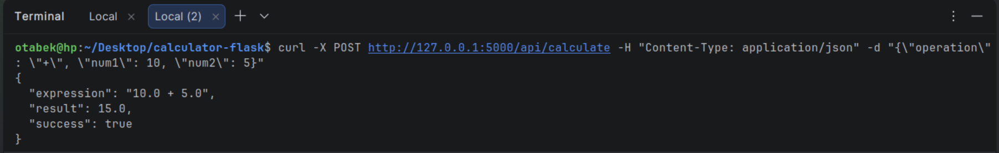
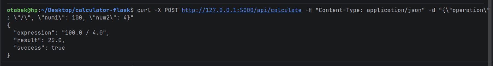
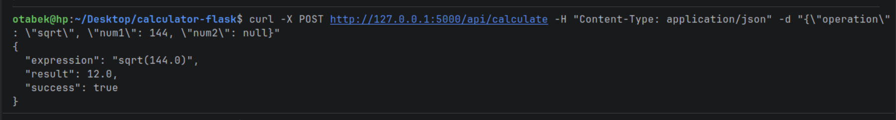
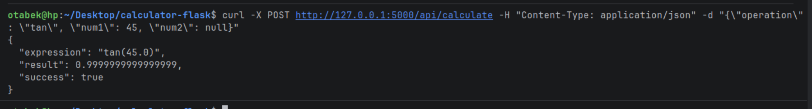
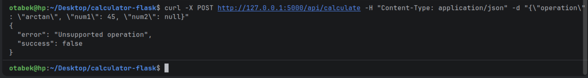

# 🧮 Flask Scientific Calculator

A web-based **scientific calculator** built using **Flask** and **Object-Oriented Programming (OOP)** principles.
This project demonstrates clean architecture, session-based history, unit conversion, REST API, and file-based data storage.

# Flask Scientific Calculator

A web-based scientific calculator built with Flask and OOP principles.

## How to Run

```bash
uv add  matplotlib
python app.py
```

Open `http://127.0.0.1:5000` in your browser.

## What was built

- ** 1** — OOP calculator with basic and scientific operations
- ** 2** — File-based history tracking and stats page with chart
- ** 3** — Session support, each user gets their own history file
- ** 4** — REST API endpoint `POST /api/calculate`

## API Screenshots








